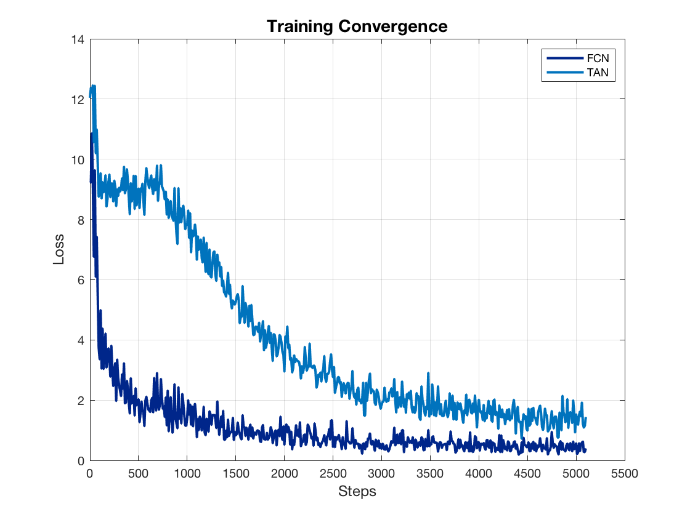

# Smooth Velocity Control for MAVs
The project is the final project of course [CS394R: Reinforcement Learning](http://www.cs.utexas.edu/~pstone/Courses/394Rfall19/). The project realized collision avoidance for a micro-air-vehicle (MAV) in simulation and can be easily extended to real-world test. 


Detailed report here.

Short presentation video here.

## Requirements
1. **Platform & Tool:** Ubuntu 16.04 LTS; ROS Kinetic; [catkin kinetic](http://wiki.ros.org/catkin).

1. **Require Packages:**

   * [ardrone_autonomy](https://github.com/AutonomyLab/ardrone_autonomy)
   * [gazebo_ros_pkgs](https://github.com/ros-simulation/gazebo_ros_pkgs/tree/hydro-devel)
   * [tum_ardrone](https://github.com/tum-vision/tum_ardrone)

2. **Python packages** required are in [requirements.txt](./requirements.txt). Install by
```
pip install -r requirements.txt
```


## Preliminaries
### Test Environment
      

Coordinates of all obstacles are available at [env.csv](./assets/env.csv).
### State $\in \mathrm{R}^{1\times 10}$

| Distances to k nearest obstacles (1*k) | Angles to k nearest obstacles (1*k) | Velocity | Yaw | Position (1*2) | 
|--------------------------------------------------------|---------------------------------------------------|----------|-----|------------------------------|

\* k is set to 3. 

### Action
Action space is the combination of actions for velocity and yaws:

| Action Index | Action                      |
|--------------|-----------------------------|
| 0            |turn left       |
| 1            |keep forward    |
| 2            |turn right      |

### Reward
Reward is decided by whether the drone collides into obstacles, how long it takes to get to the destination.

| Situation          | Reward |
|--------------------|--------|
| flying             | -1     |
| turning             | -5     |
| Collide            | -10    |

## Code Guidance
### Preparation
1. Follow [catkin tutorial](http://wiki.ros.org/catkin/Tutorials/create_a_workspace) to creat a workspace.
2. Install required ROS packages mentioned above.
3. `$cd ($workspace)/src` and put this project folder into it, change the folder name to "drone_control".
4. `$cd .. && catkin_make`.
5. `$source devel/setup.bash`.

If there is no error you are good to go.
### Environment Construction
The test environment mentioned above is constructed by [test.world](./worlds/test.world). All the stuff except the quadrotor drone are treated as obstacles.

For customizing a new world, remember to change [env.csv](./assets/env.csv) for training.
### Data Collection
**Main script**: [deep_navigation_RL.py](./src/deep_navigation_RL.py).

**Parameters can be tuned**:

`rate`: the frequency (in Hz) of writing sample data.\
`isTrain`: define whether the script is collecting data, here we set to `True`.\
`dataset`: the file containing sample data, which will be in folder "./assets".

**An example**:
```
$roslaunch drone_control RL_sim.launch rate:=1 isTrain:=True dataset:=Data.csv
```
**Collected data format**:

| State                                                  |                                                   |          |     |                              |                          |                    | Action | Reward  |
|--------------------------------------------------------|---------------------------------------------------|----------|-----|------------------------------|--------------------------|--------------------|--------|---------|
| distances to k nearest obstacles (1*k) | angles to k nearest obstacles (1*k) | velocity | yaw | position (1*2) | flying distance till now | \# trips completed | ac     | R_{t+1} |

Sample data file: [traj.csv](./assets/traj.csv).

### RL Training
**Main script**: [dqn_batch.py](./src/dqn_batch.py).

Run the script with parameters specified, for example:
```
$python 'dqn_batch.py' --dataset 'traj.csv' --ckptsave 'testckpt.h5'
```
Pretrained checkpoints [here](./ckpt/proj-dqn.h5). Convergence of our training:\

### Test Results
**Main script**: [deep_navigation_RL.py](./src/deep_navigation_RL.py).

**Parameters can be tuned**:

`rate`: the frequency (in Hz) of update action (must be same as that for collecting data).\
`isTrain`: define whether the script is collecting data, here we set to `False`.\
`ckptload`: the checkpoint file to be loaded from folder "./ckpt".

**An example**:
```
$roslaunch drone_control RL_sim.launch rate:=1 isTrain:=False ckptload:=proj-dqn.h5
```


# Notes & Issues
* Accumulate distance and \# trips are not necessarily taken into account for state.
